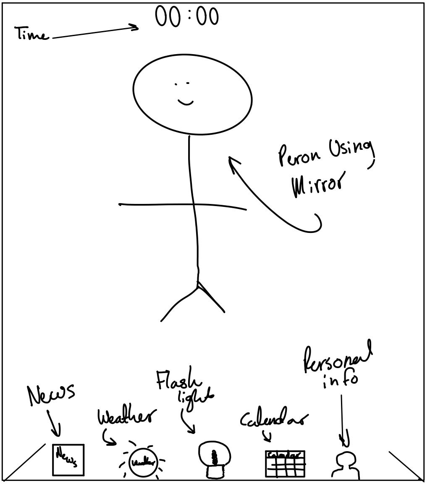

# Report

---

### Links
[Presentation page](https://monimoni0.github.io/p2.Monica.Romero.github.io/)

[GitHub repository](https://github.com/Monimoni0/p2.Monica.Romero.github.io)

[Demo](https://youtu.be/YFltciBmev4)

[Gif Demo](https://media.giphy.com/media/lc0yWQkwvGgRjCNXfq/giphy.gif)

**Common elevator uses:**  

### Getting C:
Provide the Sketch
news feed: pop up that provides the lates json news 
clock; located at the top of the mirror
weather: pop up that shows the high temperature, low temperature, and conditions for today and the rest of the week

Include the health-related information in your sketch: sleep, weight, exercises, and mirror time.
personal information: information like sleep, weight, excercise times for today and the week are available using json

### Getting B:
Implement your Sketch in Processing or p5.js.
calendar, news, clock, local weather are all read from json file 
Implement the health-related information in your sketch (select one of these): sleep, weight, exercises, and mirror time (from a csv or json file).
sleep, weight, excersise visible through the personal popup

### Getting A

- Implement one advanced feature
flashlight available through lightbulb image in userface. User can choose from a rainbow of colors.
presentation video available through demo link above.
